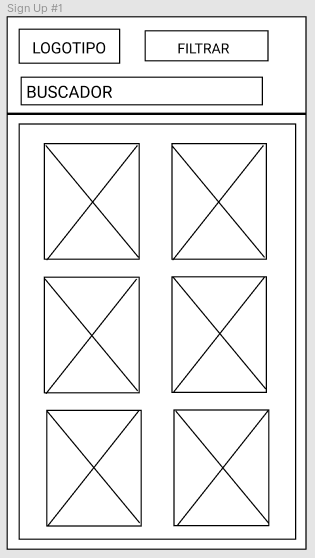
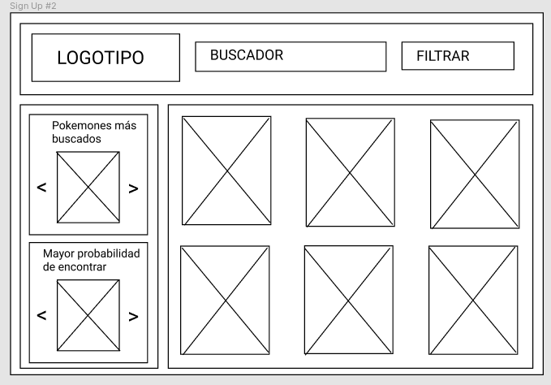
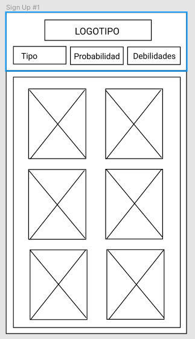
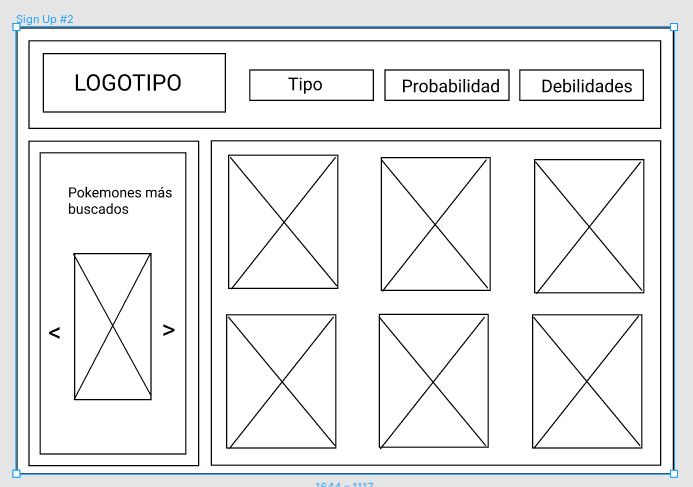
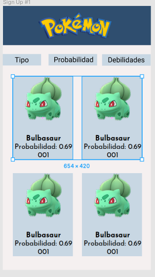
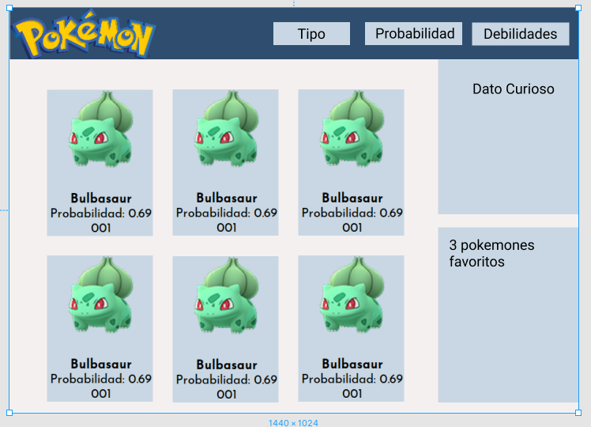

# POKEGUÍA

## Descripción del Proyecto
POKEGUÍA es una página web donde los usuarios podrán encontrar los pokémones de la región Kanto, podrán encontrar datos relevantes de cada uno de ellos, así como también filtrar de acuerdo a su tipo, a sus debilidades y a su probabilidad de ser encontrados.

## Objetivo del Proyecto

Crear una página web visualmente agradable, responsiva y fácil de usar, creada especialmente para los jugadores de Pokémon Go de nivel intermedio y avanzado que buscan información especifica.

## Prototipo de baja fidelidad
Plasmamos nuestra idea de como nos gustaría visualizar la aplicación, comenzamos haciendo un Sketch de prueba de baja fidelidad

### Primer prototipo visualización en celular

Creamos un prototipo de baja fidelidad con la aplicación Marvel, en este prototipo testeamos los botones https://marvelapp.com/417egjf/screen/58722283

### Primer prototipo visualización en escritorio

## Problemas encontrados

### Primer testeo
En el primer testeo que realizamos con los usuarios, lo que notamos fue que algunos usuarios les gustaría encontrar dentro de la página los puntos de combate (PC) de cada Pokémon, sin embargo decidimos no implementarlo ya que es un dato con el cual no contamos. 

Por cuestión de tiempo y de prioridad decidimos eliminar el buscador, enfocando como prioridad que el usuario pueda filtrar, decidimos implementar un scroll para que el usuario pueda visualizar todo el contenido en una misma pantalla, otro cambio que hicimos fue crear tres menús de opciones con su respectivo filtro en vez de mostrar todos en un solo menú.

También decidimos cambiar los dos recuadros del lado izquierdo, el primero de ellos lo cambiamos como una sección de Dato Curioso, el recuadro de abajo lo cambiamos a un menú de opciones para filtrar la Probabilidad de encontrar a un Pokémon.

### Segundo prototipo visualización en celular

### Segundo prototipo visualización en escritorio

## Prototipo de alta fidelidad

### Prototipo de visualización en celular

### Prototipo de visualización en escritorio

## Definición del usuario.

Comenzamos haciendo un análisis de la data que nos habían proporcionado, investigamos los conceptos para saber cuales eran los elementos con los que contábamos, nos apoyamos de algunas compañeras que son o eran jugadoras de Pokémon Go, las cuales nos ayudaron a entender mejor la data que teníamos.

## Encuestas a Usuarios

Como siguiente paso decidimos lanzar una encuesta para conocer cuales serian nuestros usuarios, colocamos preguntas que nos dieran información sobre cuanto tiempo le invertían jugando, Desde hace cuanto juegan, que nivel de jugador se consideraban (principiante, intermedio, avanzado), si se apoyaban de alguna pagina web para encontrar información, estas preguntas nos ayudaron a tener una mejor percepción de nuestros Usuarios y conocer los sitios que ellos frecuentaban.

Las siguientes preguntas que realizamos fueron para conocer que información les era relevante saber como por ejemplo: nombre, tipo, peso, altura, debilidades etc. basándonos en los datos con los que contábamos.

Nos dimos cuenta que nuestros usuarios eran jugadores intermedios y avanzados, por lo cual sabían en especifico que información es la que les interesa y la que necesitan, en base a eso pudimos definir los datos a filtrar. 

## Historias de Usuario

1. Enunciado: Yo como usuario de la aplicación

     - Quiero poder visualizar todos los Pokémones de la Región Kanto 

2. Enunciado: Yo como usuario de la aplicación

    - Quiero encontrar a los pokémones de acuerdo a su numero, nombre e imagen

3. Enunciado: Yo como usuario de la aplicación 

    - Quiero filtrar los pokémones de acuerdo a su tipo (planta, veneno, fuego etc)

4. Enunciado: Yo como usuario de la aplicación

    - Quiero filtrar los pokémones de acuerdo a la probabilidad que tienen para ser encontrados

## Necesidades técnicas

Este Proyecto se realizo en HTML, JavaScript y CSS

## ¿Cómo ejecutar este Proyecto?

Desde tu navegador da click en el siguiente link: https://aliciapalacios10.github.io/MEX-Data-Lovers-008/src/index.html

## Pasos para descargar, instalar y ejecutar la aplicación

Lo primero que debes hacer es forkear este repositorio y clonarlo en tu computadora, contar con un editor de texto, Para correr los test tendrás que descargar Node.js https://nodejs.org/es/, una vez descargado en la terminal ejecuta el comando npm install, para instalar las dependencias del proyecto. Una vez instalado podrás ejecutar el comando npm run test, para correr los test.

